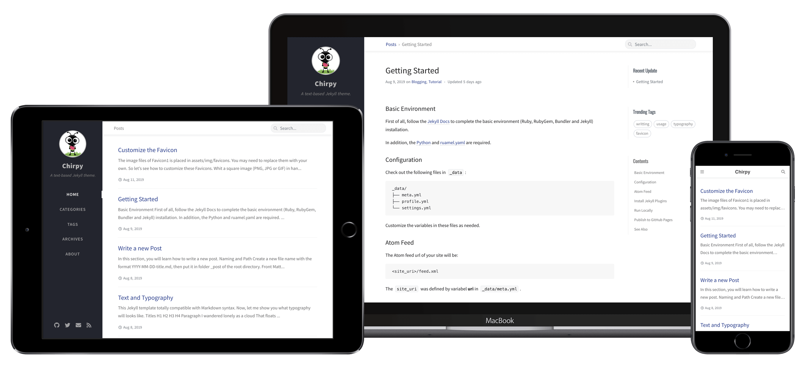

# Jekyll Theme Chirpy

[](https://travis-ci.org/cotes2020/jekyll-theme-chirpy)
[](https://github.com/cotes2020/jekyll-theme-chirpy/blob/master/LICENSE)
[](https://996.icu)



A Jekyll theme with responsive web design that focuses on text presentation. [Live Demo »](https://chirpy.cotes.info)

## Features

* Last modified date
* Table of Contents
* Disqus Comments
* Syntax highlighting
* Two Level Categories
* Search
* HTML compress
* Atom feeds
* Google Analytics
* Pageviews (Advanced)

## Quick start

First of all, complete the installation of the following environment dependencies:

- [Ruby](https://www.ruby-lang.org/en/downloads/)
- [RubyGem](https://rubygems.org/pages/download)
- [Bundler](https://bundler.io/)
- [Jekyll](https://jekyllrb.com/)
- [Python](https://www.python.org/downloads/) 
- [ruamel.yaml](https://pypi.org/project/ruamel.yaml/)

Clone the repository locally, but to prevent losing the latest features, consider using **Fork** instead of cloning. 

Install the Jekyll plugins:

```
$ bundle install
```

Boot your site locally:

```
$ bash run.sh
```sss

Now, open your favorite brower and visit <http://127.0.0.1:4000>

Please refer to the [documentation](https://chirpy.cotes.info/posts/getting-started/) for more details. Hope you like it.


## License

This work is published under [MIT](https://github.com/cotes2020/jekyll-theme-chirpy/blob/master/LICENSE) License.
